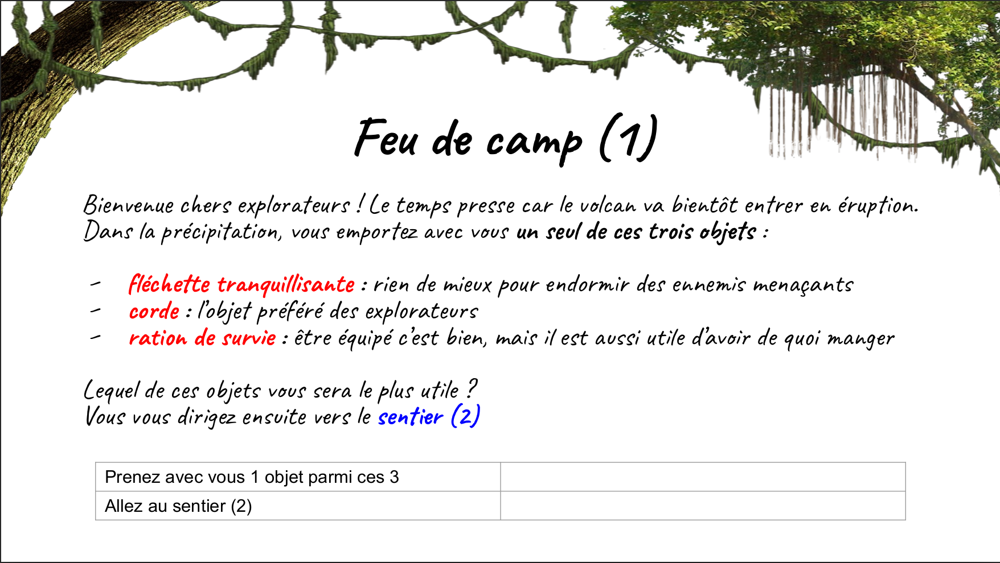
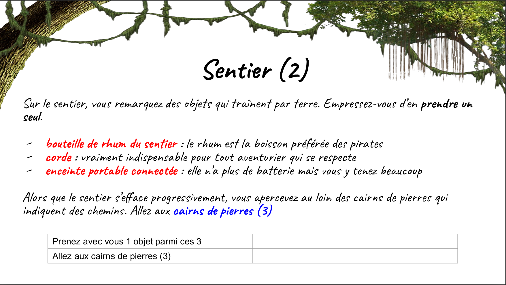
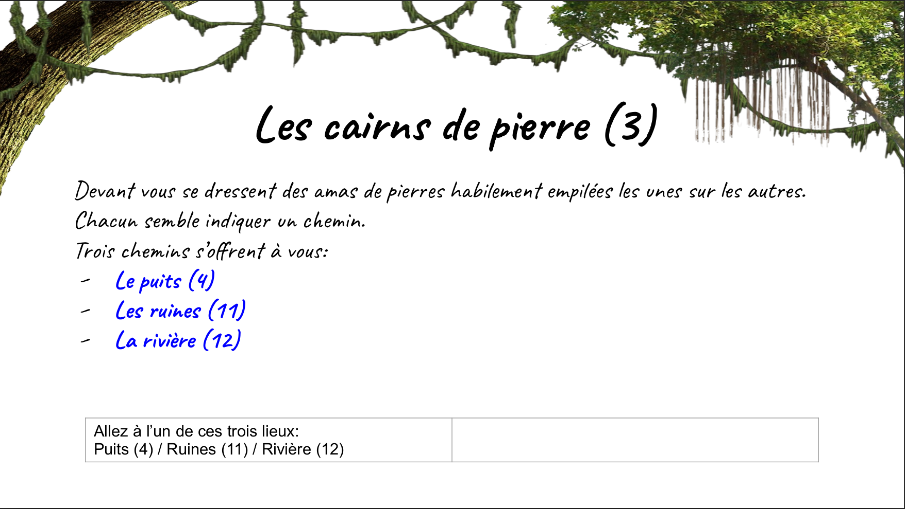
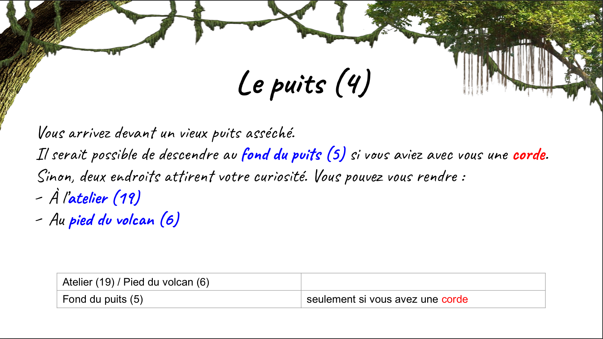
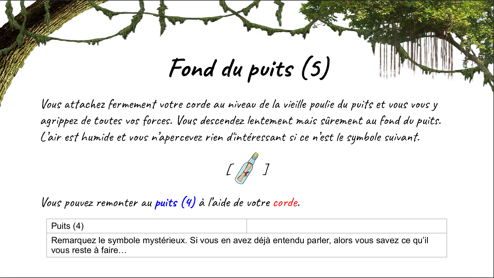
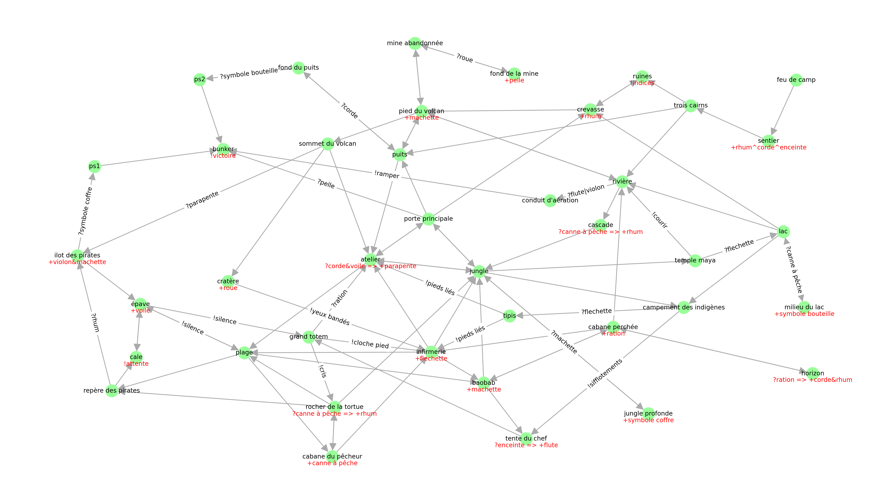

# Utilisation d'un planifieur PDDL pour résoudre un jeu de piste

J'ai été moniteur dans une colonie de vacances et nous avons créé un jeu de piste scénarisé pour les enfants dont nous nous occupions.

## Présentation du jeu de piste

### Règles du jeu
Les règles sont les suivantes:

- On commence à la balise "feu de camp" et on doit arriver le plus vite possible à la balise du "bunker".

- À chaque balise, il est possible:
  - de ramasser les objets présents à la balise
  - d'utiliser des objets que l'on possède pour en obtenir un nouveau
  - de se déplacer vers les balises voisines si l'on a les objets nécessaires

### Exemple de chemin emprunté
Voici un exemple de chemin que pourrait suivre une équipe:

Au feu de camp, l'équipe prend les flechettes tranquilisantes et se déplace vers le sentier.

Au sentier, l'équipe prend la corde et se déplace vers les cairns de pierre.

Aux cairns de pierre, l'équipe se déplace vers le puits.

Au puits, l'équipe se déplace vers le fond du puits en utilisant la corde


### Problématique
Le but de ce projet est d'utiliser un planifieur PDDL pour vérifier s'il est effectivement possible de terminer ce jeu de piste.
Autrement dit, on cherche à vérifier qu'il existe une séquence d'actions (déplacement, collecte d'objets, fabrication d'objets) permettant au joueur de se rendre à la balise du bunker en partant de la balise du feu de camp.

## Modélisation du problème

### Représentation des règles du jeu par un graphe
Le fichier `game_graph/graph-node-list.txt` contient la liste des balises du jeu ainsi que les objets qu'il est possible d'y trouver.
Par exemples:
- `feu de camp: +flechette^corde^ration` veut dire que le feu de camp est une balise à laquelle le joueur a le droit de ramasser un seul des trois objets "flechette", "corde", ou "ration".
- `atelier: ?corde&voile => +parapente` veut dire que "l'atelier" est une balise à laquelle le joueur a le droit de construire un "parapente" s'il possède une "corde" et une "voile".
- `riviere:` veut dire que la "rivière" est une balise à laquelle on ne trouve aucun objet.

Le fichier `game_graph/graph-edge-list.txt` contient la liste des connexions reliant les balises entre elles.
Par exemples:
- `rivière, pied du volcan` veut dire que le joueur a le droit de se rendre au "pied du volcan" depuis la "rivière".
- `sommet du volcan, ilot des pirates: ?parapente` veut dire que le joueur a le droit de se rendre sur "l'ilot des pirates" depuis le "sommet du volcan" à condition qu'il possède un "parapente".

Pour visualiser l'ensemble des possibilités d'actions offertes par ce jeu de piste, on peut dessiner le graphe suivant en exécutant `python draw_graph.py`:


### Traduction du graphe des possibilités en un problème PDDL
Le script python `graph_to_pddl.py` permet de convertir le graphe décrit dans les deux fichiers `game_graph/graph-node-list.txt` et `game_graph/graph-edge-list.txt` en un problème pddl `game_pddl/problem.pddl`.

Le fichier `domain.pddl` a été écrit manuellement et contient l'encodage en PDDL des actions réalisables par le joueur, peu importe les liens liant les balises entre elles.

## Résultat
En exécutant le planifieur PDDL avec la commande `python -B -m pddl-parser.pddl_parser.planner game_pddl/domain.pddl game_pddl/problem.pddl` pendant moins d'une seconde, on se rend compte qu'il existe une manière très rapide de gagner, impliquant seulement 16 actions dont 14 déplacements:
```
Time: 70.47132897377014s
plan:
move p feu_de_camp sentier
make_choice p sentier choice_sentier enceinte
move p sentier trois_cairns
move p trois_cairns riviere
move p riviere cascade
move p cascade jungle
move p jungle campement_des_indigenes
move p campement_des_indigenes tente_du_chef
collect_using_1 p tente_du_chef flute enceinte
move p tente_du_chef grand_totem
move p grand_totem rocher_de_la_tortue
move p rocher_de_la_tortue jungle
move p jungle temple_maya
move p temple_maya riviere
move_using p riviere conduit_d_aeration flute
move p conduit_d_aeration bunker
```

Cependant, le jeu de piste a été conçu de sorte qu'il existe de nombreuses manières différentes de gagner, faisant passer le joueur par d'autres balises et lui racontant donc des histoires différentes.

Pour tester si d'autres solutions sont bien réalisables par le joueur, on enlève la possibilité de ramasser "l'enceinte portable connectée" au "sentier".
Ceci empêche de l'utiliser à la "tente du chef des indigènes" pour obtenir la "flute" permettant ensuite de charmer le serpent bloquant l'entrée du "conduit d'aération" qui mène au "bunker".
En ajoutant cette contrainte, voici la meilleure suite d'action trouvée par le planifieur PDDL, contenant 21 actions dont 19 déplacements:
```
Time: 192.0815737247467s
plan:
move p feu_de_camp sentier
move p sentier trois_cairns
move p trois_cairns riviere
move p riviere pied_du_volcan
move p pied_du_volcan sommet_du_volcan
move p sommet_du_volcan cratere
collect p cratere roue
move p cratere infirmerie
move p infirmerie baobab
move p baobab cabane_perchee
move p cabane_perchee riviere
move p riviere pied_du_volcan
move p pied_du_volcan mine_abandonnee
move_using p mine_abandonnee fond_de_la_mine roue
collect p fond_de_la_mine pelle
move p fond_de_la_mine mine_abandonnee
move p mine_abandonnee pied_du_volcan
move p pied_du_volcan sommet_du_volcan
move p sommet_du_volcan atelier
move p atelier porte_principale
move_using p porte_principale bunker pelle
```

En enlevant aussi la possibilité de ramasser la "pelle" au fond de la mine, le planifieur PDDL trouve cette solution, contenant 22 actions dont 18 déplacements:
```
Time: 241.09312343597412s
plan:
move p feu_de_camp sentier
make_choice p sentier choice_sentier corde
move p sentier trois_cairns
move p trois_cairns puits
move p puits atelier
move p atelier plage
move p plage cabane_du_pêcheur
collect p cabane_du_pêcheur canne_a_pêche
move p cabane_du_pêcheur infirmerie
collect p infirmerie flechette
move p infirmerie jungle
move p jungle temple_maya
move_using p temple_maya lac flechette
move_using p lac milieu_du_lac canne_a_pêche
collect p milieu_du_lac symbole_bouteille
move p milieu_du_lac lac
move p lac crevasse
move p crevasse pied_du_volcan
move p pied_du_volcan puits
move_using p puits fond_du_puits corde
move_using p fond_du_puits ps2 symbole_bouteille
move p ps2 bunker
```
